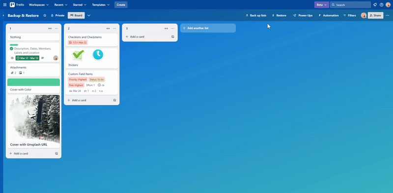

[English](description.md) | [日本語](description.jp.md)

## このPower-Upのリストページにある説明は次のとおりです。

**=== 説明の始まり ===**

必要なときにいつでもカードとリストを簡単にバックアップおよび復元できます。

‌

認証後、これらのボタンが利用可能になります。

- **⇓ Back up:** カードをバックアップするカードボタン
- **Back up list:** リストをバックアップするリスト操作ボタン
- **⇓ Back up lists:** 開いているすべてのリストをバックアップするボードボタン
- **⇑ Restore:** カード、リストまたはすべてのリストを復元するボードボタン

### ✅ 復元された各カードに含まれるフィールド

- 説明
- 日付
- メンバー
- ラベル
- 場所
- 生ファイル以外の添付ファイル
- 色付きカバー
- Unsplashの写真付きカバー
- チェックリスト
- チェックリストアイテム
- カスタムフィールドのアイテム
- スタンプ

### ❌ 復元された各カードに含まれないフィールド

- 添付された生ファイル
- 添付ファイル付きカバー
- コメントを含むアクティビティ

---

#### 🌐 PCでサポートされているブラウザ

- Chrome
- Firefox
- Edge
- Safari

注：残念ながら、FirefoxのRestore(復元)ポップアップの仕様は他のブラウザとは少し異なります。

**=== 説明の終わり ===**

‌

## ボタン

### カードをバックアップする `⇓ Back up` カードボタン

認証が完了していない場合、このボタンを選択すると `Authorize` (認証)ポップアップが開きます。認証後、このボタンを選択してカードのバックアップを開始できます。

### リストをバックアップする `Back up list` リスト操作ボタン

認証が完了していない場合、このボタンを選択すると `Authorize` (認証)ポップアップが開きます。認証後、このボタンを選択してリストのバックアップを開始できます。

### 開いているすべてのリストをバックアップする `⇓ Back up lists` ボードボタン

認証が完了していない場合、このボタンを選択すると `Authorize` (認証)ポップアップが開きます。認証後、このボタンを選択してすべてのリストのバックアップを開始できます。

### カード、リストまたはすべてのリストを復元する `⇑ Restore` ボードボタン

認証が完了していない場合、このボタンを選択すると `Authorize` (認証)ポップアップが開きます。認証後、このボタンを選択して `Restore` (復元)ポップアップを開くことができます。

## ポップアップ

### `Authorize` (認証)ポップアップ

このポップアップで `Click to authorize` (クリックして認証)を選択すると、 `Authorize` (認証)ウィンドウが開きます。このウィンドウで `Allow` (許可)を選択すると、認証が完了します。

### `Restore` (復元)ポップアップ

このポップアップで `Select file to restore` (復元するファイルを選択)を選択すると、 `Open` (開く)ウィンドウが開きます。このウィンドウで、復元したいバックアップファイルを選択し、 `Open` (開く)を選択すると復元が開始されます。

#### 各ブラウザの `Restore` (復元)ポップアップ仕様の違い

- Chrome、Edge、Safariの場合、復元はRestore(復元)ポップアップの呼び出し元によって処理されます。 `Select file to restore` (復元するファイルを選択)を選択すると、ポップアップは閉じます。
- Firefoxの場合、エラーを回避するため、復元はRestore(復元)ポップアップによって処理されます。復元中は、ポップアップに `Select file to restore` (復元するファイルを選択)ボタンの代わりに `⚠️ Please do not close this popup until the restoration is complete.` (復元が完了するまでこのポップアップを閉じないでください。)テキストが表示されます。復元が完了すると、ポップアップは閉じます。

## バックアップファイル

### ファイル名

- カードがバックアップされると、バックアップファイルの名前は `card_{カード名}.json` になります。
- リストがバックアップされると、バックアップファイルの名前は `list_{リスト名}.json` になります。
- すべてのリストがバックアップされると、バックアップファイルの名前は `lists_{ボード名}.json` になります。

上記のファイル名から、不正なファイル名文字 `<>:"/\|?*` が削除されます。

### 内容

カード、リストまたはすべてのリストがバックアップされると、バックアップファイルの内容は次のようになります。カードは、そのカードのみを含むリストとしてバックアップされます。

```json
{
  "board": {
    "id": "",
    "name": "",
    "members": [
      {
        "id": "",
        "fullName": "",
        "username": ""
      }
    ],
    "labels": [
      {
        "id": "",
        "name": "",
        "color": ""
      }
    ],
    "customFields": [
      {
        "id": "",
        "name": "",
        "type": "",
        // options[]: Optional
        "options": [
          {
            "id": "",
            "value": {
              "text": ""
            },
            "color": ""
          }
        ]
      }
    ]
  },
  "lists": [
    {
      "id": "",
      "name": "",
      "cards": [
        {
          "id": "",
          "name": "",
          "desc": "",
          "due": "", // Nullable
          "start": "", // Nullable
          "dueComplete": false,
          "idMembers": [""],
          "idLabels": [""],
          "address": "", // Nullable
          "locationName": "", // Nullable
          // coordinates{}: Nullable
          "coordinates": {
            "latitude": 0,
            "longitude": 0
          },
          "attachments": [
            {
              "id": "",
              "name": "",
              "url": ""
            }
          ],
          // cover{}: Nullable。colorもidUploadedBackgroundも存在しない場合、nullが設定されます。
          "cover": {
            "color": "", // Nullable
            "url": "", // Nullable。idUploadedBackgroundが存在する場合、sharedSourceUrlの値が設定されます。存在しない場合、nullが設定されます。
            "size": "",
            "brightness": ""
          },
          "checklists": [
            {
              "id": "",
              "name": "",
              "checkitems": [
                {
                  "id": "",
                  "name": "",
                  "checked": false, // `state === "complete"` の結果が設定されます。
                  "due": "", // Nullable
                  "dueReminder": 0, // Nullable
                  "idMember": "" // Nullable
                }
              ]
            }
          ],
          "customFieldItems": [
            {
              "id": "",
              "idCustomField": "",
              // value{}: Optional
              "value": {
                "checked": "", // Optional
                "date": "", // Optional
                "number": "", // Optional
                "text": "" // Optional
              },
              "idValue": "" // Optional
            }
          ],
          "stickers": [
            {
              "id": "",
              "image": "",
              "top": 0,
              "left": 0,
              "zIndex": 1,
              "rotate": 0
            }
          ]
        }
      ]
    }
  ]
}
```

## アラート

- カードのバックアップが開始されると、アラートメッセージ `Backing up card` (カードをバックアップ中)が表示されます。
- リストのバックアップが開始されると、アラートメッセージ `Backing up list` (リストをバックアップ中)が表示されます。
- すべてのリストのバックアップが開始されると、アラートメッセージ `Backing up lists` (すべてのリストをバックアップ中)が表示されます。
- 復元が開始されると、アラートメッセージ `Restoring, please wait...` (復元中、お待ちください)が表示されます。
- 復元が完了すると、アラートメッセージ `Restoration complete 🎉` (復元完了)が表示されます。
- カードのバックアップ中にエラーが発生した場合、アラートメッセージ `❌ Failed to back up card` (カードのバックアップに失敗しました)が表示されます。
- リストのバックアップ中にエラーが発生した場合、アラートメッセージ `❌ Failed to back up list` (リストのバックアップに失敗しました)が表示されます。
- すべてのリストのバックアップ中にエラーが発生した場合、アラートメッセージ `❌ Failed to back up lists` (すべてのリストのバックアップに失敗しました)が表示されます。
- 復元中にエラーが発生した場合、アラートメッセージ `❌ Failed to restore` (復元に失敗しました)が表示されます。

## 制限

### レート制限の回避

- Trello Rest APIのレスポンスステータスが429の場合、プロセスは `Exponential Backoff And Full Jitter` で待機し、その後リクエストを再度呼び出します。
- Trello Rest APIのレスポンスに含まれる `x-rate-limit-api-key-remaining` ヘッダーの値が100以下の場合、プロセスは次のリクエストの直前に `Exponential Backoff And Full Jitter` で待機します。
- Trello Rest APIのレスポンスに含まれる `x-rate-limit-api-token-remaining` ヘッダーの値が50以下の場合、プロセスは次のリクエストの直前に `Exponential Backoff And Full Jitter` で待機します。

`Exponential Backoff And Full Jitter` はミリ秒単位で `Math.min(32000, 1000 * 2 ** i) * Math.random()` として計算されます。ここで `i` は上記のケースでインクリメントされ、それ以外の場合はリセットされます。これらの機能はウィンドウタブのセッションごとに動作します。

### ボタンの抑制

- すべてのバックアップおよび復元ボタンは、処理中は無効になります。
- すべてのバックアップおよび復元ボタンは、いずれかを選択してから0.5秒間無効になります。

これらの機能はウィンドウタブのセッションごとに動作します。

## 設定

### アカウントを認証

認証が完了していない場合、このPower-Upの `設定` で `アカウントを認証` オプションを選択して `Authorize` (認証)ポップアップを開くことができます。

### Power-Upの設定を編集

#### Functions related to board changes during restoration (復元中のボード変更に関する機能)

- `Add labels if missing` (ラベルがない場合は追加する)チェックボックス
  - チェックすると、バックアップ内の各ラベルについて、現在のボードに同じ名前とタイプのラベルが存在しない場合、そのバックアップされたラベルが現在のボードに追加されます。
  - デフォルトでチェックされています。
- `Add custom fields and their options if missing` (カスタムフィールドとそのオプションがない場合は追加する)チェックボックス
  - チェックすると、バックアップ内の各カスタムフィールドについて、現在のボードに同じ名前とタイプのカスタムフィールドが存在しない場合、そのバックアップされたカスタムフィールドが現在のボードに追加されます。
  - 同様に、チェックすると、バックアップ内の各カスタムフィールドオプションについて、現在のボードの対応するカスタムフィールドに同じテキストと色のオプションが存在しない場合、そのバックアップされたオプションが対応するカスタムフィールドに追加されます。
  - 現在のボードがTrelloの無料プランの場合、このチェックボックスは無効になります。また、カスタムフィールドとそのオプションは現在のボードに追加されません。
  - デフォルトでチェックされています。

#### Where to restore (復元する場所)

- `To the left of all lists on this board` (このボード上のすべてのリストの左側)ラジオボタン
  - チェックすると、カード、リストまたはすべてのリストのいずれかが、現在のボード上のすべてのリストの左側に復元されます。カードは、そのカードのみを含むリストとして復元されます。各リストの復元順序は逆順です。
  - デフォルトではチェックされていません。
- `To the right of all lists on this board` (このボード上のすべてのリストの右側)ラジオボタン
  - チェックすると、カード、リストまたはすべてのリストのいずれかが、現在のボード上のすべてのリストの右側に復元されます。カードは、そのカードのみを含むリストとして復元されます。各リストの復元順序は正順です。
  - デフォルトでチェックされています。

#### Buttons to display (表示するボタン)

- `Card button to back up card` (カードをバックアップするカードボタン)チェックボックス
  - チェックすると、 `⇓ Back up` カードボタンが表示されます。
  - デフォルトでチェックされています。
- `List action to back up list` (リストをバックアップするリスト操作ボタン)チェックボックス
  - チェックすると、 `Back up list` リスト操作ボタンが表示されます。
  - デフォルトでチェックされています。
- `Board button to back up all open lists` (開いているすべてのリストをバックアップするボードボタン)チェックボックス
  - チェックすると、 `⇓ Back up lists` ボードボタンが表示されます。
  - デフォルトでチェックされています。
- `Board button to restore card, list or lists` (カード、リストまたはすべてのリストを復元するボードボタン)チェックボックス
  - チェックすると、 `⇑ Restore` ボードボタンが表示されます。
  - デフォルトでチェックされています。

#### `Download error log for reporting` (報告用のエラーログをダウンロードする)ボタン

いつでもこのボタンを選択して、報告用のエラーログファイルをダウンロードできます。ファイルは `error.json` という名前で、内容は以下のようになります。

```json
{
  "message": "", // Optional。messageの値がstackの値に含まれている場合、messageは削除されます。
  "stack": "",
  "date": "" // エラー発生時のISO 8601形式の日付が設定されます。
}
```

## 復元時のID処理

### カードのメンバーID

バックアップされたカードの各メンバーIDについて、現在のボード上にそのメンバーIDが存在する場合、復元されたカードにそのメンバーIDが設定されます。

### カードのラベルID

バックアップされたカードの各ラベルIDについて、現在のボード上に同じ名前と色のラベルが存在する場合、復元されたカードにはその既存のラベルIDが設定されます。この機能は、オプションでラベルを追加した後に実行されます。

### チェックリストアイテムのメンバーID

バックアップされたチェックリストアイテムの各メンバーIDについて、現在のボード上にそのメンバーIDが存在する場合、復元されたチェックリストアイテムにそのメンバーIDが設定されます。

### カスタムフィールドアイテムのカスタムフィールドID

バックアップされたカスタムフィールドアイテムの各カスタムフィールドIDについて、現在のボード上に同じ名前とタイプのカスタムフィールドが存在する場合、復元されたカスタムフィールドアイテムにはその既存のカスタムフィールドIDが設定されます。この機能は、オプションでカスタムフィールドとそのオプションを追加した後に実行されます。

### カスタムフィールドアイテムのカスタムフィールドオプションID

バックアップされたカスタムフィールドアイテムの各カスタムフィールドオプションID( `idValue` )について、現在のボード上の対応するカスタムフィールドに同じテキストと色のオプションが存在する場合、復元されたカスタムフィールドアイテムの `idValue` にその既存のオプションIDが設定されます。この機能は、オプションでカスタムフィールドとそのオプションを追加した後に実行されます。
