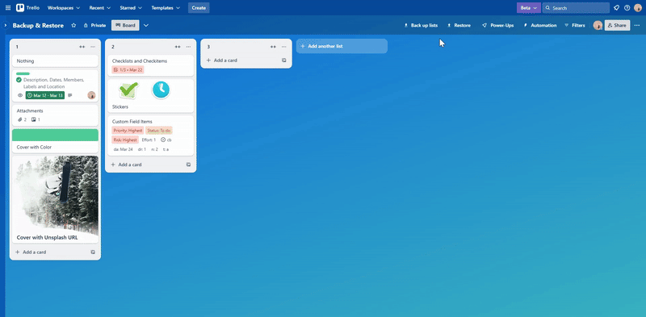

[English](description.md) | [日本語](description.jp.md)

## Here's the description from this Power-Up Listings page.

**=== beginning of description ===**

Easily back up and restore cards and lists whenever needed.

‌

After authorization, these buttons will be available.

- **⇓ Back up:** Card button to back up card
- **Back up list:** List action to back up list
- **⇓ Back up lists:** Board button to back up all open lists
- **⇑ Restore:** Board button to restore card, list or lists

### ✅ Fields included on each restored card

- Description
- Dates
- Members
- Labels
- Location
- Attachments except raw files
- Cover with Color
- Cover with Photo from Unsplash
- Checklists
- Checkitems
- Custom Field Items
- Stickers

### ❌ Fields not included on each restored card

- Attached raw files
- Cover with Attachment
- Activity including comments

---

#### 🌐 Browsers supported on PC

- Chrome
- Firefox
- Edge
- Safari

Note: Unfortunately, Firefox's Restore popup specifications are a little different from those of other browsers.

**=== end of description ===**

‌

## Buttons

### `⇓ Back up` card button to back up card

If authorization is not complete, when the user selects the button, `Authorize` popup opens. After authorization, the user can select the button to begin backing up card.

### `Back up list` list action to back up list

If authorization is not complete, when the user selects the button, `Authorize` popup opens. After authorization, the user can select the button to begin backing up list.

### `⇓ Back up lists` board button to back up all open lists

If authorization is not complete, when the user selects the button, `Authorize` popup opens. After authorization, the user can select the button to begin backing up lists.

### `⇑ Restore` board button to restore card, list or lists

If authorization is not complete, when the user selects the button, `Authorize` popup opens. After authorization, the user can select the button to open `Restore` popup.

## Popups

### `Authorize` popup

When the user selects `Click to authorize` in the popup, `Authorize` window opens. If the user selects `Allow` in the window, authorization is complete.

### `Restore` popup

When the user selects `Select file to restore` in the popup, `Open` window opens. In the window, the user can select backup file they want to restore and select `Open` to begin restoration.

#### Differences in `Restore` popup specifications of each browser

- For Chrome, Edge and Safari, the restoration is handled by the caller of the Restore popup. When the user selects `Select file to restore`, the popup closes.
- For Firefox, the restoration is handled by the Restore popup to avoid errors. During the restoration, the popup says `⚠️ Please do not close this popup until the restoration is complete.` instead of `Select file to restore` button. When the restoration is complete, the popup closes.

## Backup file

### Filename

- When card is backed up, the backup file is named `card_{card-name}.json`.
- When list is backed up, the backup file is named `list_{list-name}.json`.
- When lists are backed up, the backup file is named `lists_{board-name}.json`.

Illegal filename characters `<>:"/\|?*` are removed from the above filenames.

### Contents

When card, list or lists is backed up, the contents of the backup file look like this. The card is backed up as a list containing only the card.

```json
{
  "board": {
    "id": "",
    "name": "",
    "members": [
      {
        "id": "",
        "fullName": "",
        "username": ""
      }
    ],
    "labels": [
      {
        "id": "",
        "name": "",
        "color": ""
      }
    ],
    "customFields": [
      {
        "id": "",
        "name": "",
        "type": "",
        // options[]: Optional
        "options": [
          {
            "id": "",
            "value": {
              "text": ""
            },
            "color": ""
          }
        ]
      }
    ]
  },
  "lists": [
    {
      "id": "",
      "name": "",
      "cards": [
        {
          "id": "",
          "name": "",
          "desc": "",
          "due": "", // Nullable
          "start": "", // Nullable
          "dueComplete": false,
          "idMembers": [""],
          "idLabels": [""],
          "address": "", // Nullable
          "locationName": "", // Nullable
          // coordinates{}: Nullable
          "coordinates": {
            "latitude": 0,
            "longitude": 0
          },
          "attachments": [
            {
              "id": "",
              "name": "",
              "url": ""
            }
          ],
          // cover{}: Nullable. If neither color nor idUploadedBackground exists, null is set.
          "cover": {
            "color": "", // Nullable
            "url": "", // Nullable. If idUploadedBackground exists, the value of sharedSourceUrl is set; if not, null is set.
            "size": "",
            "brightness": ""
          },
          "checklists": [
            {
              "id": "",
              "name": "",
              "checkitems": [
                {
                  "id": "",
                  "name": "",
                  "checked": false, // The result of `state === "complete"` is set.
                  "due": "", // Nullable
                  "dueReminder": 0, // Nullable
                  "idMember": "" // Nullable
                }
              ]
            }
          ],
          "customFieldItems": [
            {
              "id": "",
              "idCustomField": "",
              // value{}: Optional
              "value": {
                "checked": "", // Optional
                "date": "", // Optional
                "number": "", // Optional
                "text": "" // Optional
              },
              "idValue": "" // Optional
            }
          ],
          "stickers": [
            {
              "id": "",
              "image": "",
              "top": 0,
              "left": 0,
              "zIndex": 1,
              "rotate": 0
            }
          ]
        }
      ]
    }
  ]
}
```

## Alerts

- When card backup begins, alert message `Backing up card` appears.
- When list backup begins, alert message `Backing up list` appears.
- When lists backup begins, alert message `Backing up lists` appears.
- When restoration begins, alert message `Restoring, please wait...` appears.
- When restoration is complete, alert message `Restoration complete 🎉` appears.
- If an error occurs while backing up card, alert message `❌ Failed to back up card` appears.
- If an error occurs while backing up list, alert message `❌ Failed to back up list` appears.
- If an error occurs while backing up lists, alert message `❌ Failed to back up lists` appears.
- If an error occurs while restoring, alert message `❌ Failed to restore` appears.

## Limits

### Avoiding rate limits

- If Trello Rest API response status is 429, the process sleeps with `Exponential Backoff And Full Jitter`, then calls the request again.
- If `x-rate-limit-api-key-remaining` header in Trello Rest API response is less than or equal to 100, the process sleeps with `Exponential Backoff And Full Jitter` immediately before the next request.
- If `x-rate-limit-api-token-remaining` header in Trello Rest API response is less than or equal to 50, the process sleeps with `Exponential Backoff And Full Jitter` immediately before the next request.

`Exponential Backoff And Full Jitter` is calculated in milliseconds as `Math.min(32000, 1000 * 2 ** i) * Math.random()`, where `i` is incremented in the above cases and reset otherwise. These features work per window tab session.

### Suppressing buttons

- All backup and restore buttons are disabled during processing.
- All backup and restore buttons are disabled for 0.5 seconds after either is selected.

These features work per window tab session.

## Settings

### Authorize account

If authorization is not complete, the user can select `Authorize account` option in the Power-Up `Settings` to open `Authorize` popup.

### Edit Power-Up settings

#### Functions related to board changes during restoration

- `Add labels if missing` checkbox
  - If checked, for each label in the backup, if a label with the same name and type does not exist on the current board, the backed up label is added to the current board.
  - It is checked by default.
- `Add custom fields and their options if missing` checkbox
  - If checked, for each custom field in the backup, if a custom field with the same name and type does not exist on the current board, the backed up custom field is added to the current board.
  - Similarly, if checked, for each custom field option in the backup, if a option with the same text and color does not exist in the corresponding custom field on the current board, the backed up option is added to the corresponding custom field.
  - If the current board is on Trello’s free plan, the checkbox is disabled. Additionally, custom fields and their options are not added to the current board.
  - It is checked by default.

#### Where to restore

- `To the left of all lists on this board` radio button
  - If checked, either card, list or lists is restored to the left of all lists on the current board. The card is restored as a list containing only the card. The order of restoration for each list is reversed.
  - It is unchecked by default.
- `To the right of all lists on this board` radio button
  - If checked, either card, list or lists is restored to the right of all lists on the current board. The card is restored as a list containing only the card. The order of restoration for each list is normal.
  - It is checked by default.

#### Buttons to display

- `Card button to back up card` checkbox
  - If checked, `⇓ Back up` card button appears.
  - It is checked by default.
- `List action to back up list` checkbox
  - If checked, `Back up list` list action appears.
  - It is checked by default.
- `Board button to back up all open lists` checkbox
  - If checked, `⇓ Back up lists` board button appears.
  - It is checked by default.
- `Board button to restore card, list or lists` checkbox
  - If checked, `⇑ Restore` board button appears.
  - It is checked by default.

#### `Download error log for reporting` button

The user can select the button at any time to download the error log file for reporting. The file is named `error.json` which contents look like this.

```json
{
  "message": "", // Optional. If the message value is included in the stack value, the message is deleted.
  "stack": "",
  "date": "" // ISO 8601 date when error occured is set.
}
```

## ID handling during restoration

### Member IDs on cards

For each member ID on the backed up cards, if the member ID exists on the current board, the member ID is set on the restored card.

### Label IDs on cards

For each label ID on the backed up cards, if a label with the same name and color exists on the current board, the existing label ID is set on the restored card. This function is executed after optionally adding labels.

### Member IDs in checkitems

For each member ID in the backed up checkitems, if the member ID exists on the current board, the member ID is set in the restored checkitem.

### Custom field IDs in custom field items

For each custom field ID in the backed up custom field items, if a custom field with the same name and type exists on the current board, the existing custom field ID is set in the restored custom field item. This function is executed after optionally adding custom fields and their options.

### Custom field option IDs in custom field items

For each custom field option ID as `idValue` in the backed up custom field items, if a option with the same text and color exists in the corresponding custom field on the current board, the existing option ID is set as `idValue` in the restored custom field item. This function is executed after optionally adding custom fields and their options.
